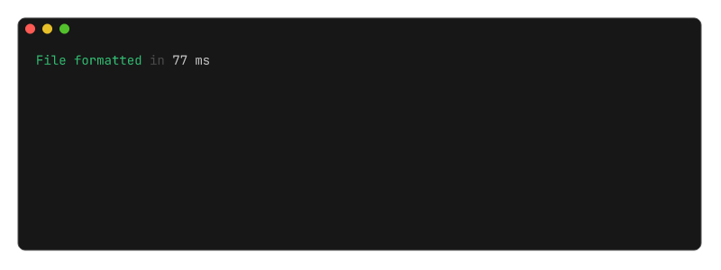
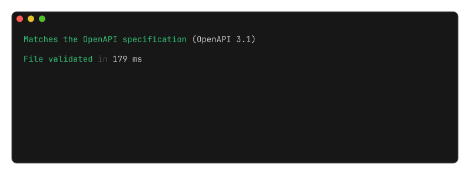
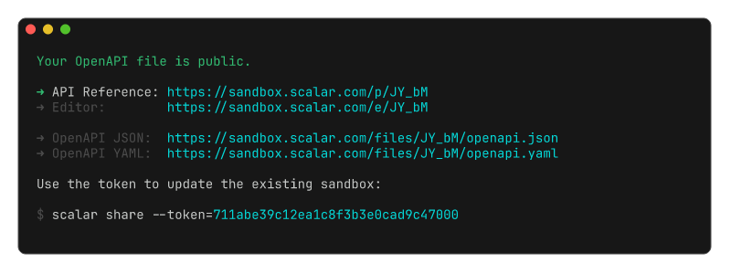
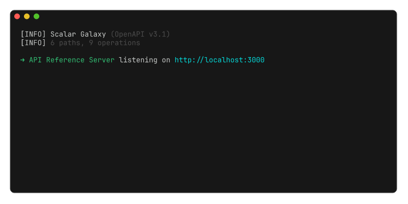
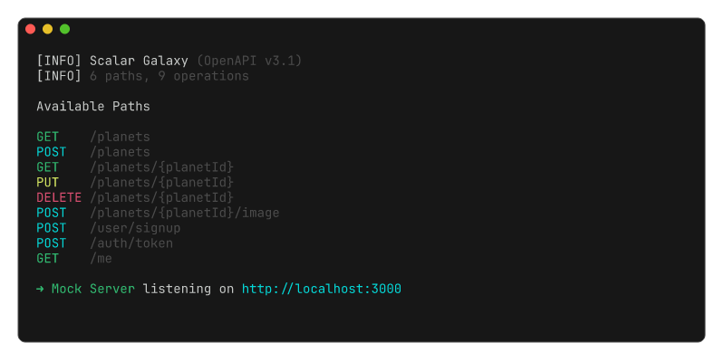

# Scalar CLI

[](https://www.npmjs.com/package/@scalar/cli)
[](https://www.npmjs.com/package/@scalar/cli)
[](https://www.npmjs.com/package/@scalar/cli)
[](https://discord.gg/scalar)

Command-line interface to work with OpenAPI files


## Features

- Format & validate OpenAPI files
- Upload your OpenAPI files to Scalar
- Get a fully mocked API for testing purposes
- Preview your API reference
- ~~Bundle multiple OpenAPI files~~ (work in progress)

## Quickstart

```bash
npx @scalar/cli help
```

## Installation

If you really want to become friends you should install the CLI:

```bash
npm -g install @scalar/cli
```

Otherwise just prefix all commands with `npx @scalar/cli` instead of `scalar`. That’s fine, too.

### Conflict: EEXIST: file already exists

There’s another `scalar` CLI, which is bundled with `git`. If you run into naming conflicts, but never use the other CLI anyway, you can replace it like this:

```bash
npm -g --force install @scalar/cli
```

Or, if you want to keep using the other `scalar` CLI, you can just stick to `npx` (or `pnpm dlx`):

```bash
# Execute without installation (npm)
npx @scalar/cli help

# Execute without installation (pnpm)
pnpm dlx @scalar/cli help
```

## Commands

### format



The given JSON file will be formatted with Prettier.

```bash
scalar format
scalar format openapi.json --output openapi.yaml
scalar format https://example.com/openapi.json --output openapi.json
```

### validate



To check whether your OpenAPI file adheres to the Swagger 2.0, OpenAPI 3.0 or OpenAPI 3.1 specification, run the following command:

```bash
scalar validate
scalar validate openapi.json
scalar validate https://example.com/openapi.json
```

### share



To quickly share an OpenAPI file or reference with someone, you can use the share command:

```bash
scalar share
scalar share openapi.json
```

This will upload your OpenAPI file to the [Scalar Sandbox](https://sandbox.scalar.com/) to give you a public reference URL and a public URL to your OpenAPI JSON file.

### serve



You can quickly spin up a local server with an API reference based on your OpenAPI file.

```bash
scalar serve
scalar serve openapi.json
scalar serve openapi.json --port 1234
scalar serve openapi.json --watch
scalar serve https://example.com/openapi.json --watch
```

### mock



We can even mock your API, and it’s just one command:

```bash
scalar mock
```

This will boot up a server on port 3000 which gives you an API returning the dummy data according to your schema.

If you’d like to watch for file changes (to the OpenAPI file), do it like this:

```bash
scalar mock openapi.json --watch
```

You can also change the port like this:

```bash
scalar mock openapi.json --watch --port 8080
```

And it even works with URLs:

```bash
scalar mock https://example.com/openapi.json --watch
```

### void


Start a HTTP dummy server, that just responds with the request data.

```bash
scalar void
```

This will boot up a server on port 3000, but you can also change the port like this:

```bash
scalar void --port 8080
```

### bundle

> Warning! The bundle command isn’t ready for production yet. Circular dependencies are not supported yet.

Some OpenAPI files reference other files from the file system or an URL. You can bundle those files and make them a single file:

```bash
scalar bundle openapi.json --output bundle.json
```

If you don’t provide an `output` file name, the input file will be overwritten.

### init

If you’re tired of passing the file name again and again, just configure it once:

```bash
scalar init
```

This will create a `scalar.config.json` file for you. All commands will use the configured OpenAPI file by default.

### check

Validate a Scalar Configuration file (`scalar.config.json`), gives helpful hints to fix invalid configurations. To check a `scalar.config.json` in the same folder:

```bash
scalar check
```

Or to validate a specific file:

```bash
scalar check some-custom-folder/scalar.config.json
```

## Options

### --version

If you want to check which version of the CLI is installed, just run this:

```bash
scalar --version
```

### --help


```bash
scalar --help
```

## GitHub Actions

To validate your OpenAPI file in GitHub Actions, add this workflow:

```yml
# .github/workflows/validate-openapi-file.yml
name: Validate OpenAPI File

on:
  push:
    branches:
      - main
  pull_request:
    branches:
      - main

jobs:
  validate:
    runs-on: ubuntu-latest

    steps:
      - uses: actions/checkout@v4
      - name: Use Node.js
        uses: actions/setup-node@v4
        with:
          node-version: 20
      - name: Validate OpenAPI File
        # Replace `./my-openapi-file.yaml` with the correct path and filename for your project.
        # Or: run `npx @scalar/cli init` and add the config file to your repository.
        run: npx @scalar/cli validate ./my-openapi-file.yaml
```

## Development

Set up the development environment:

```bash
pnpm install
pnpm @scalar/cli --version
```

To symlink the package and use it globally on your machine:

```bash
pnpm cli:link
scalar --version
```

## Community

We are API nerds. You too? Let’s chat on Discord: <https://discord.gg/scalar>

## License

The source code in this repository is licensed under [MIT](https://github.com/khulnasoft/scalar/blob/main/LICENSE).
